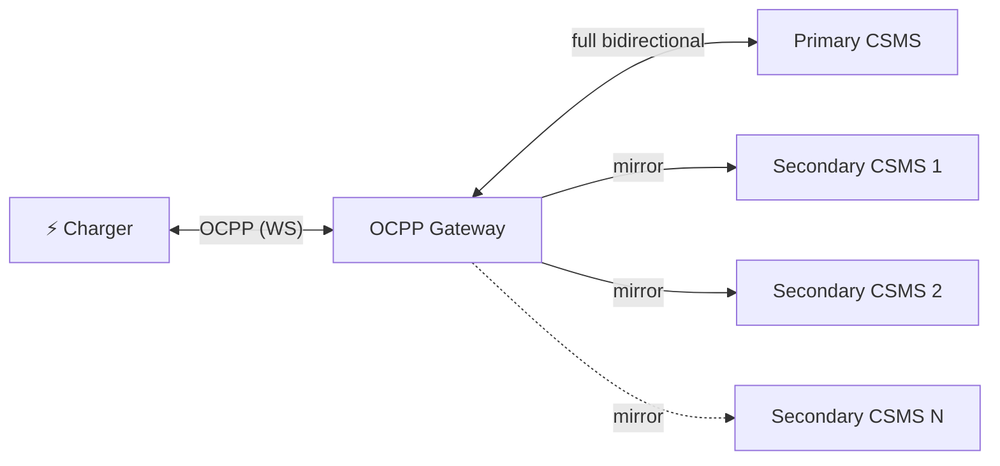

# ocpp-gateway

A lightweight **OCPP WebSocket gateway** that sits between your EV chargers and one or more CSMS backends. Each charge point is routed by its **chargeBoxId** to its own **primary CSMS** (full bidirectional control) and, optionally, to one or more **secondary backends** that receive a read-only mirror of the charger's traffic — perfect for monitoring, analytics, or migrating between platforms without reconfiguring your chargers.

A single endpoint serves every charger: the gateway reads the chargeBoxId from the connection URL and looks it up in a routing table. Built with Node.js and TypeScript. Supports OCPP 1.6 and 2.0.1.

> Forked from [joulo-nl/joulo-ocpp-proxy](https://github.com/joulo-nl/joulo-ocpp-proxy) (MIT). The original uses a single global primary/secondary configuration for all chargers; this fork replaces it with a **per-chargeBoxId routing table**.

## How it works



For each charge point the gateway resolves a **route** (one primary + N secondaries):

| Direction      | Primary CSMS | Secondary CSMS (×N) |
| -------------- | ------------ | ------------------- |
| Charger → CSMS | ✅ Forwarded | ✅ Mirrored         |
| CSMS → Charger | ✅ Forwarded | ❌ Ignored          |

The **primary CSMS** has full control — it can send commands like `RemoteStartTransaction` back to the charger. **Secondary** backends receive a read-only copy of the charger's messages; their responses are never sent back to the charger. Secondary connections are best-effort — if one fails, it never affects the charger or the primary link.

### Secondary reliability

Because charger sessions can stay open for days or weeks, secondaries get a few extras so a brief network blip doesn't silently break your mirror for the rest of the session:

- **Auto-reconnect** — if a secondary disconnects, the gateway reconnects after 10s and keeps retrying until the charger session ends.
- **Keepalive ping** — the gateway pings each secondary every 30s so idle connections aren't dropped by load balancers or CSMS timeouts, and force-reconnects if no pong is seen within 90s.
- **Bounded queue** — while a secondary is reconnecting, up to 100 messages per secondary are buffered and replayed once it's back. Older messages are dropped first if the buffer fills.

If the **primary** disconnects, the charger connection is closed (a charger expects exactly one controlling CSMS). A secondary failure never affects the charger or the primary link.

## Routing configuration

Routing is driven by a JSON file (path from `ROUTES_FILE`, default `./routes.json`). The gateway **fails to start** if the file is missing or invalid.

```json
{
  "default": {
    "primary": "wss://csms.example.com/ocpp",
    "secondaries": []
  },
  "chargers": {
    "CP-001": {
      "primary": "wss://primary-csms.example.com/ocpp",
      "secondaries": ["wss://analytics.example.com/ocpp"]
    }
  }
}
```

- **`default`** (required) — route used for any chargeBoxId not listed under `chargers`.
- **`chargers`** (optional) — exact-match overrides keyed by chargeBoxId.
- Each route has a `primary` (string, required) and `secondaries` (array of strings, optional).

**Resolution:** for a charger with id `X`, the gateway uses `chargers["X"]` if present, otherwise `default`.

**Target URL:** for every upstream (primary and each secondary), the gateway appends the chargeBoxId as a path segment: `<baseUrl>/<chargeBoxId>`. Different backends may therefore use entirely different base paths. In the example above, charger `CP-001` connects to:

- primary → `wss://primary-csms.example.com/ocpp/CP-001`
- secondary → `wss://analytics.example.com/ocpp/CP-001`

while every other charger goes only to `wss://csms.example.com/ocpp/<chargeBoxId>`.

### Hot reload

The gateway watches the routes file and reloads it on change. Existing charger sessions keep the route they connected with; only new connections pick up the change. If a reload fails validation, the error is logged and the previous table stays in effect.

## Quick start

### Using Docker (recommended)

A pre-built, multi-arch image is published to GitHub Container Registry on every push to `main` and on version tags.

```bash
cp routes.example.json routes.json   # edit with your CSMS URLs

docker run -d \
  -p 9000:9000 \
  -v "$(pwd)/routes.json:/app/routes.json:ro" \
  ghcr.io/juherr/ocpp-gateway:1.0.0
```

### Using Docker Compose

```bash
git clone https://github.com/juherr/ocpp-gateway.git
cd ocpp-gateway
cp routes.example.json routes.json
# Edit routes.json with your CSMS URLs
docker compose up -d
```

### From source

```bash
git clone https://github.com/juherr/ocpp-gateway.git
cd ocpp-gateway
mise install   # installs the pinned Node version (mise.toml); optional but recommended
npm install
npm run build
cp routes.example.json routes.json
ROUTES_FILE=./routes.json npm start
```

## Configuration

All configuration is done through environment variables:

| Variable      | Required | Default         | Description                         |
| ------------- | -------- | --------------- | ----------------------------------- |
| `PORT`        | No       | `9000`          | Port the gateway listens on         |
| `ROUTES_FILE` | No       | `./routes.json` | Path to the JSON routing table      |
| `LOG_LEVEL`   | No       | `info`          | `debug`, `info`, `warn`, or `error` |

## Charger setup

Point your charger's OCPP backend URL to the gateway instead of the CSMS directly:

```
Before:  wss://your-csms.example.com/ocpp/CP-001
After:   ws://gateway-host:9000/CP-001
```

The gateway extracts the **last path segment** of the incoming URL (URL-decoded) as the chargeBoxId. These URL patterns are all accepted:

```
ws://gateway:9000/CP-001
ws://gateway:9000/ocpp/CP-001
ws://gateway:9000/ws/CP-001
```

### Authentication

If the charger sends HTTP Basic Auth credentials, the gateway forwards the `Authorization` header to all upstream CSMS backends (primary and secondaries) as-is.

### Sub-protocol negotiation

The gateway negotiates OCPP sub-protocols (`ocpp1.6`, `ocpp2.0`, `ocpp2.0.1`) with the charger and propagates the negotiated sub-protocol to every upstream backend.

### Health check

`GET /healthz` returns `200 ok` while the service is running.

## Logging

Logs are structured JSON written to stdout/stderr. Each charger session logs under a tag equal to its chargeBoxId, and the resolved route (primary + secondaries) is logged on connect:

```json
{"time":"2026-06-17T10:00:00.000Z","level":"info","tag":"proxy","msg":"proxy listening","port":9000,"routesFile":"./routes.json"}
{"time":"2026-06-17T10:00:01.000Z","level":"info","tag":"proxy","msg":"charger connected","chargePointId":"CP-001","protocol":"ocpp1.6","primary":"wss://primary-csms.example.com/ocpp","secondaries":["wss://analytics.example.com/ocpp"]}
```

Set `LOG_LEVEL=debug` to see individual OCPP messages.

## Development

```bash
npm install
npm run lint       # Vite+ (Oxlint + Oxfmt): lint + format check
npm run format     # Vite+ auto-fix (format + lint)
npm run typecheck  # tsc --noEmit (type check)
npm run build      # bundle with Vite+ (vp pack / Rolldown) → dist/index.cjs
npm test           # run unit + integration tests (Vitest)
npm run dev        # watch-bundle and run
```

Tests cover route resolution (`chargers[id]` vs `default`, target-URL construction) and an end-to-end integration scenario with mock primary/secondary CSMS servers verifying that the primary is bidirectional, secondary responses never reach the charger, and `Authorization` + sub-protocol are propagated.

### Commits & Git hooks

`npm install` sets up [husky](https://typicode.github.io/husky/) Git hooks automatically:

- **pre-commit** — `lint-staged` formats and lints the staged files (`vp fmt --write`, `vp lint --fix`).
- **commit-msg** — [commitlint](https://commitlint.js.org/) enforces [Conventional Commits](https://www.conventionalcommits.org/) (e.g. `feat: …`, `fix(connection): …`).
- **pre-push** — runs the full test suite (`npm test`).

User-facing changes go in [`CHANGELOG.md`](CHANGELOG.md) under `## [Unreleased]`, following [Keep a Changelog](https://keepachangelog.com/en/1.1.0/).

## Building the Docker image

```bash
docker build -t ocpp-gateway .
```

The image uses a multi-stage build and runs as a non-root user (`node`).

## Credits

This project is a fork of [joulo-ocpp-proxy](https://github.com/joulo-nl/joulo-ocpp-proxy) by [Joulo](https://joulo.nl), extended with per-chargeBoxId routing.

## License

[MIT](LICENSE) — use it however you like.